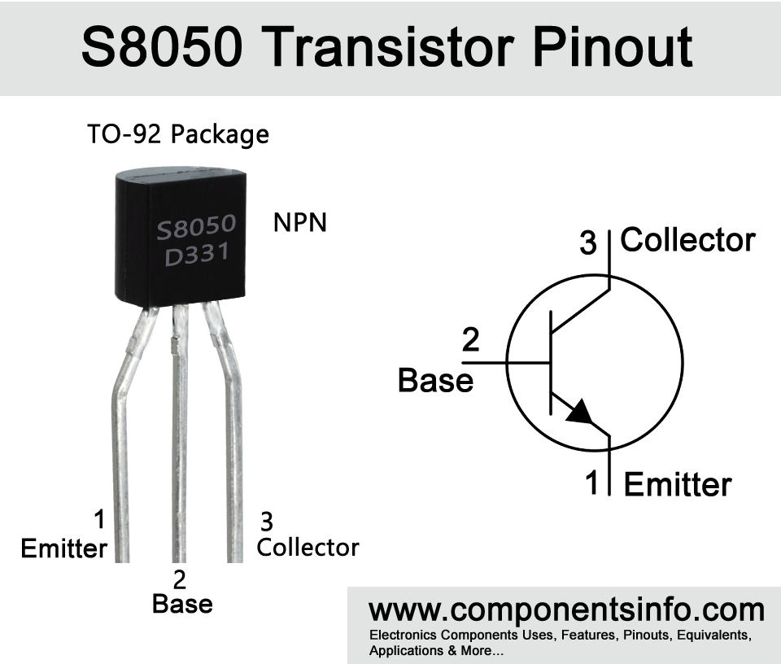
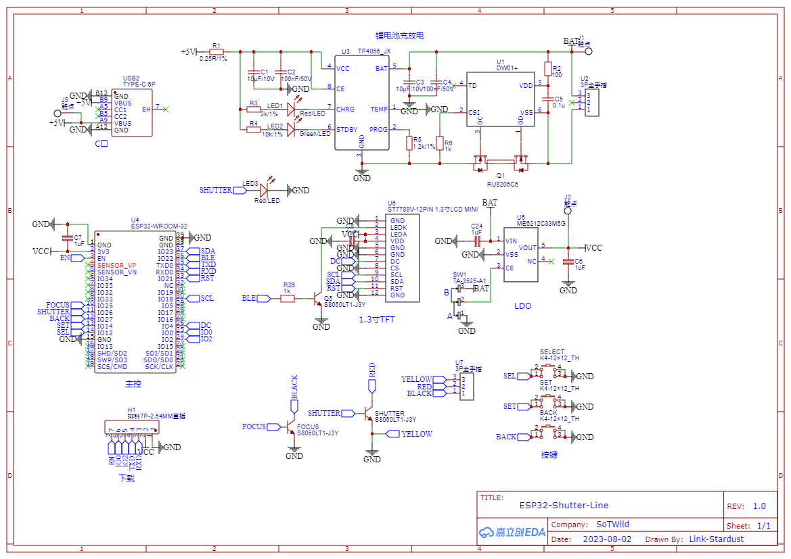
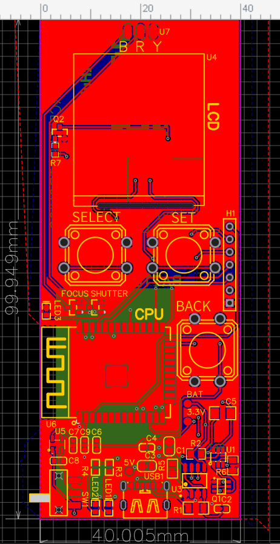

# ESP32-Shutter-Line

###### 【Designed By SoTWild】   

成品图

------

## 目录：

------

## 概述：

ESP32-Shutter-Line 是一款基于 **ESP32-WROOM** 制作的快门线，主要适配**佳能**机型。

###### 主要功能：

> 1.自定义设置
>
> 2.最多三种预设
>
> 3.无线遥控&设置
>
> [是否定时几秒]+[拍摄几张]+[间隔时间]+[是否要自动对焦]+[快门速度]

#### 项目开发人员：

[$SoTWild$](https://github.com/SoTWild)

------

### FAQ：

#### 1）整个设备的造价大约是多少？

$$< 30 ￥$$

#### 2）复刻的难度如何？

硬件**SMD**，软件**开源**，综合来看很容易复刻。

#### 3）续航时间？

充电芯片采用**TP4056**，可以通过配置**PROG**引脚控制**充电电流**，我这里使用了**500mA**充电电流，电池为**500mAh聚合物锂电池**，理论上可以供电超过**3小时**，充电时间约为**1小时**。（运行电流约为**150mA**）

#### 4）成品的体积？

$$1.3$$寸 TFT ，**长$$10cm$$，宽$$4cm$$，厚$$8mm$$**（不加电池）。

#### 5）主控芯片是什么？

**ESP32-D0WD-V3** 双核，模组为**ESP32-WROOM**。

#### 6）开发环境？

Visual Studio Code + Platform IO

------

## Change Log：

------

## ESP32-Shutter-Line 硬件

### 功能实现原理：

在 **RS-80N3** 型号快门线中，引出了**黄、白、红**三线，根据实验（网上查询也可以）可得知：

> **白红**短接**自动对焦+拍摄**，两端 **3.3V**
>
> **白黄**短接**自动对焦**，两端 **3.3V**
>
> **黄红**短接**无效果**，两端 **0V**

由此可得**白线连接了相机内部的GND**网络，**黄、红大概率连接内部芯片IO**引脚，芯片通过检测IO对地电平判断是否有对应拍摄指令。

通过三极管可令 ESP32 对引脚进行控制，这里使用 **S8050** 三极管。

S8050

加上锂电池充放电管理、屏幕驱动以及按键，可以简单设计出以下原理图：

### 原理图：

### PCB：

使用**双层**工艺。

### BOM表：

| ID   | Name                        | Designator       | Footprint                          | Price  |
| ---- | --------------------------- | ---------------- | ---------------------------------- | ------ |
| 1    | K4-12×12_TH                 | BACK,SELECT,SET  | KEY-TH_4P-L12.0-W12.0-P5.00-LS12.5 | 0.6171 |
| 2    | 10μF/10V                    | C1,C3            | 0805_C_JX                          |        |
| 3    | 100nF/50V                   | C2,C4            | 0603_C_JX                          |        |
| 4    | 0.1u                        | C5               | 1206                               |        |
| 5    | 1uF                         | C6,C7,C8,C9      | C0603                              | 0.0353 |
| 6    | S8050LT1-J3Y                | FOCUS,Q2,SHUTTER | SOT-23_L2.9-W1.3-P1.90-LS2.4-BR    | 0.1153 |
| 7    | 排针7P-2.54MM直插           | H1               | 排针2.54MM7P                       | 0.6804 |
| 8    | 触点                        | BAT,5V,3.3V      | 触点                               |        |
| 9    | Red/LED                     | LED1,LED3        | 0603_D_JX                          |        |
| 10   | Green/LED                   | LED2             | 0603_D_JX                          |        |
| 11   | RU8205C6                    | Q1               | SOT-23-6                           | 0.2888 |
| 12   | 0.25R/1%                    | R1               | 1206_R_JX                          |        |
| 13   | 100                         | R2               | 805                                |        |
| 14   | 1k                          | R6               | 805                                |        |
| 15   | 2k/1%                       | R3               | 0603_R_JX                          |        |
| 16   | 10k/1%                      | R4               | 0603_R_JX                          |        |
| 17   | 1.2k/1%                     | R5               | 0805-R                             |        |
| 18   | 1k                          | R7               | R0603                              |        |
| 19   | TA-3525-A1                  | SW1              | SW-SMD_3P-L9.1-W3.5-P2.50-EH6.8    | 0.9702 |
| 20   | DW01+                       | U1               | SOT-23-6-L                         |        |
| 21   | 3P金手指                    | BAT,U7           | 3P金手指                           |        |
| 22   | TP4056_JX                   | U3               | SOP8_150MIL_JX                     |        |
| 23   | ST7789V-12PIN 1.3寸LCD MINI | U4               | ST7789V-12PIN                      |        |
| 24   | ME6212C33M5G                | U5               | SOT-23-5_L3.0-W1.7-P0.95-LS2.8-BL  | 0.2218 |
| 25   | ESP32-WROOM-32              | U6               | WIFIM-SMD_ESP32-WROOM-32-N4        | 20.16  |
| 26   | TYPE-C 6P                   | USB1             | TYPE-C-SMD_TYPE-C-6P               | 0.3558 |

------

## ESP32-Shutter-Line 软件

###### 

------

## 其他

###### 总结经验：

> 怎么调试都不成功的话，重新下载库文件再配置一遍会好
>
> LCD的RES最好不要省事练板子RST（EN），单独设置引脚更稳定
>
> 使用SPIFFS请 `include` `FS.h` 以及 `SD.h` ，第一次使用SPIFFS请格式化（-10025）
>
> for函数int i请赋值
>
> 乘除进制单位转换